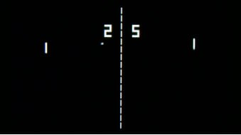

# ping-pong

Ping-pong game in c

<br> 

***== Quest received. Develop an src/pong.c program for a two-player game, 
similar to Pong. To display the graphics, only use ASCII characters (with output 
to the terminal). You need to implement the step-by-step 
version using only the material of the course studied 
so far and the standard library.***

* ***Keys***:

***A/Z and K/M - to move the rackets;***
ZZ
***Space Bar - to skip an action at a certain step of the game in step-by-step mode.***

* ***Graphics***

***The field is a 80 x 25-symbol rectangle.*** 

***Racket size is 3 symbols;*** 

***Ball size is 1 symbol.***

* ***UI/UX***
<br>  <br>

***When one of the players scores 21 points, congratulations to the winner are displayed on the screen and the game ends.==***

* ***Loyihani ishga tushirish uchun:***

# Run the program


## Requirements

To compile and run this project, you will need:

- A C compiler, such as **gcc** (GNU Compiler Collection).
- (Optional) **make** utility, if you use a Makefile for build automation.

## Installation

### Clone the repository

First, clone the repository to your local machine:

```bash
git clone 
```
### Compiling the program
You can compile the C program using gcc or another C compiler. Here is an example using gcc:

```bash
gcc -o pong main.c
```
After compilation, you can run the program with:
```bash
./main.c
```
